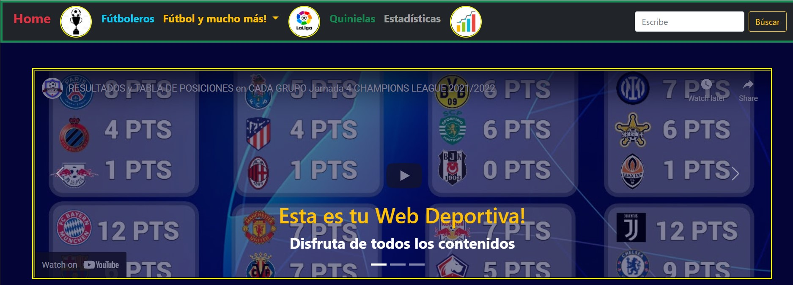

## Proyecto-2--Epics

### FútbolRafi.Com

Accede a la web: [FútbolRafi.com](https://futbolrafi.netlify.app/home)

Se trata de un proyecto en el cual se va a desarrollar una web deportiva para fúboleros, en donde se podrá encontrar todos los partidos jugados de diferentes ligas, Santander, la Premier, la BundesLiga entre otras. También se podrá consultar la clasificación y estadísticas tales como: Nº de goles, Partidos jugados o la media de goles/partido.
En la página de partidos se podrá realizar filtros de partidos ganados, perdidos, empatados o partidos por jugar.

Toda la información está conectada de manera asíncrona a una API por lo que la información está actualizada en todo momento haciendo de esta web dinámica y no estática.

En cuanto atenologías hemos empleado: 

- HTML: Es un lenguaje de marcado que lo hemos usado para estructurar las páginas y poner los ids, clases y scripts de conexion a CSS y JS. 
***
- CSS: Lo hemos usado para darle estilo a las páginas y hemos usado diferentes propiedas y alguna animación como el spinner.
***
- Bootstrap: Lo hemos usado para darle un diseño más estandarizado a todas las páginas usando diferentes clases en sus correspondientes etiquetas, por ejemplo un carrusel de vídeo e imágenes.
***
- JavaScript: Ha sido la tecnología más utilizada con ella le hemos dado dinamismo a la página, hemos realizado distintas funciones, bucles For, ForEach cuyo resultado ha sido la manipulación de objetos (DOM) de la API, hemos obtenidos los objetos los hemos recoorrido y filtrado y hemos creado nuevas tablas con sus correspondientes buscadores botones y filtros.

Y para conectarnos a la API hemos usado la función Fetch a la aplicación de Postman:

La estructura de la web se compone de:

1. HOME:
2. Partidos de las ligas y UEFA:
3. Clasificación de equipos:
4. Estadísticas:

Al texto en Markdown puedes añadirle formato como **negrita** o *cursiva* de una manera muy sencilla.
